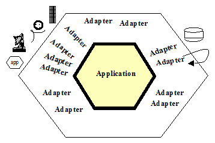

# The Pattern: Ports and Adapters (‘’Object Structural’’) / Ports & Adapters / Hexagonal Architecture

Hexagonal Architecture, also known as Ports and Adapters Architecture, is a design pattern that promotes modularity and isolation in software systems. The goal is to design an application that can be driven by various sources, including users, programs, automated tests, and batch scripts. The application should also be developed and tested independently from the devices and databases it will eventually run on.

## Core Concept

- Hexagonal Architecture separates an application into three main components: the **core**, **ports**, and **adapters**.
- The **core** contains the business logic and domain model of the application.
- **Ports** define interfaces for communication with external systems, acting as entry and exit points.
- **Adapters** implement the ports, bridging the gap between the core and external systems.

## Benefits

- **Modularity**: Hexagonal Architecture enhances the flexibility and maintainability of the software by keeping core logic separate from external concerns.
- **Testability**: Isolation of core logic and use of interfaces make unit testing and mocking easier.
- **Flexibility**: Allows different types of user interfaces, databases, and external systems to be integrated without affecting the core logic.
- **Decoupling**: Dependencies are minimized, promoting loose coupling between components.

## Interaction

- External systems, such as user interfaces or databases, interact with the application through defined ports.
- Adapters translate requests from external systems into calls to the core.
- The core processes the requests, and the response is sent back through the adapters.

## Use Cases

Hexagonal Architecture is beneficial for applications that require:

- **Evolution**: Systems likely to change over time due to shifting requirements.
- **Integration**: Integration with various external systems or services.
- **Testing**: Extensive testing, especially unit testing and mocking.
- **Maintenance**: Long-term maintainability and adaptability.

By adhering to Hexagonal Architecture, software systems can achieve a higher degree of flexibility, testability, and adaptability, facilitating the development and evolution of robust applications.

## Driver-Application Interaction

- Drivers (users, programs, automated tests, batch scripts) communicate with the application through a designated port.
- Requests from drivers are converted by adapters specific to each driver's technology into usable procedure calls or messages for the application.
- The application remains agnostic of the driver's technology, ensuring seamless communication.

## Application-Adapter Interaction

- When the application needs to send data, it passes it through a port to an adapter.
- The adapter converts the data into appropriate signals for the receiving technology (human or automated).
- The application interacts with adapters on all sides, maintaining semantic coherence without needing knowledge of the other side's nature.

This design allows for flexible and isolated development and testing of the application, accommodating a variety of drivers and technologies.

## Motivation for Separation of Business Logic in Software

Software applications have historically faced challenges with business logic becoming entangled in user interface code. This leads to several issues:

1. **Testing Complexity**: Automated tests become difficult due to dependencies on visual elements that frequently change, hindering comprehensive testing.
2. **Transition Challenges**: Shifting from human-driven use to batch processing becomes problematic due to UI-specific dependencies.
3. **Limited Automation**: Enabling program-to-program interaction becomes complex when business logic is embedded in UI.

The common attempted solution is to create a new architecture layer, promising to segregate business logic. However, without proper detection mechanisms, this often fails, resulting in a recurrence of the original issue.

Imagine a scenario where every application function is accessible through an API or function call:

- **Automated Testing**: QA can run automated tests against the API to identify new code issues before finalizing GUI details.
- **Early Test Cases**: Business experts can create test cases before GUI finalization, ensuring accurate programming.
- **Headless Deployment**: Applications can be deployed in 'headless' mode, allowing other programs to utilize their functionality.
- **Regression Testing**: Automated regression tests identify any violations of the separation promise.

A similar problem exists when application logic depends on external databases or services:

- **Dependency Challenges**: Tying application logic to databases leads to programmer disruptions when databases are unavailable.
- **Symmetry**: Despite appearing unrelated, a symmetry between UI-business logic and logic-database dependencies exists.

Addressing these issues involves a common solution strategy: separating critical logic from external dependencies to enhance testing, automation, and overall robustness of software systems.

## Nature of Hexagonal Architecture Solution

Hexagonal Architecture addresses entanglement between business logic and interactions with external entities, resolving problems on both user-side and server-side.

### Symmetry and Ports

- Error: Entanglement between business logic and external interactions.
- Solution: Asymmetry between 'inside' and 'outside' parts of the application.
- Code from 'inside' should not leak into 'outside'.
- Communication occurs via 'ports' to external agencies.

### Ports and Adapters

- Port: Represents a purposeful conversation with external entities.
- Adapter: Converts API definitions to signals for specific devices.
- Example: GUI as an adapter, automated test harnesses, batch drivers.
- External communication: Retrieving data using database protocol.
- Adapters: SQL, flat file, mock database, etc.

### Hexagonal Architecture

- Hexagon visualizes inside-outside asymmetry and port nature.
- Allows flexible placement of ports and adapters.
- 'Hexagonal architecture' derives from this visual effect.

### Port and Adapters Pattern

- 'Port and adapters' term reflects purposes of components.
- Ports: Define purposeful conversations.
- Adapters: Suit various technologies plugging into ports.
- Examples: Phone answering machine, touch-tone phone, GUI, test harness, http interface, mock/real databases.

### Focus and Asymmetry

- Primary focus: Inside-outside asymmetry.
- External items treated as identical from the application's perspective.

Hexagonal Architecture separates business logic from external interactions, promoting flexibility, testability, and modularity in software design.

## Structure

- Ports and adapters are used to design software.
- Two main types: "primary" and "secondary."
- Primary parts drive the software, secondary parts are interacted with.
- FIT is used for primary parts, mocks for secondary parts.
- Arrange primary parts on the left (or top) and secondary parts on the right (or bottom).

### Use Cases and Application Boundary

- Use cases should focus on what the software does, not technical details.
- Write use cases at the application boundary for clarity and maintainability.

### Number of Ports

- You can have different numbers of ports.
- Suggested: Two, three, or four ports is a good starting point.
- The right number depends on your specific project.

## Known Uses

The image above shows an application with four ports and several adapters at each port. This was derived from an application that listened for alerts from the national weather service about earthquakes, tornadoes, fires and floods, and notified people on their telephones or telephone answering machines. At the time we discussed this system, the system’s interfaces were identified and discussed by ‘’technology, linked to purpose’’. There was an interface for trigger-data arriving over a wire feed, one for notification data to be sent to answering machines, an administrative interface implemented in a GUI, and a database interface to get their subscriber data.

The people were struggling because they needed to add an http interface from the weather service, an email interface to their subscribers, and they had to find a way to bundle and unbundle their growing application suite for different customer purchasing preferences. They feared they were staring at a maintenance and testing nightmare as they had to implement, test and maintain separate versions for all combinations and permutations.

Their shift in design was to architect the system’s interfaces ‘’by purpose’’ rather than by technology, and to have the technologies be substitutable (on all sides) by adapters. They immediately picked up the ability to include the http feed and the email notification (the new adapters are shown in the drawing with dashed lines). By making each application executable in headless mode through APIs, they could add an app-to-add adapter and unbundle the application suite, connecting the sub-applications on demand. Finally, by making each application executable completely in isolation, with test and mock adapters in place, they gained the ability to regression test their applications with stand-alone automated test scripts.

